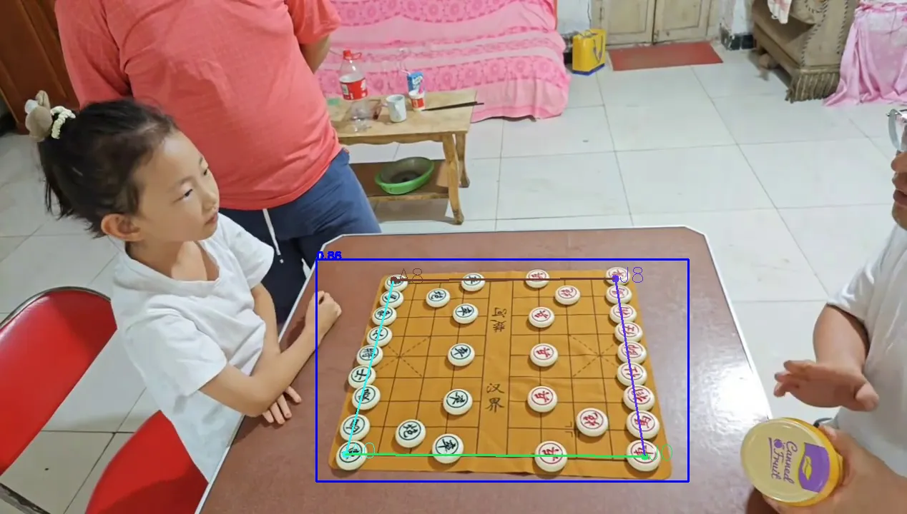
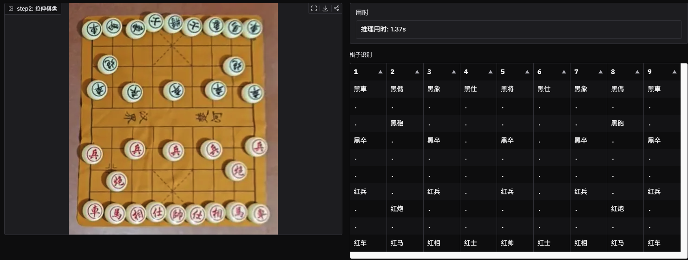
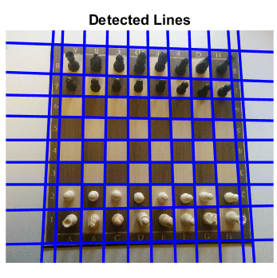
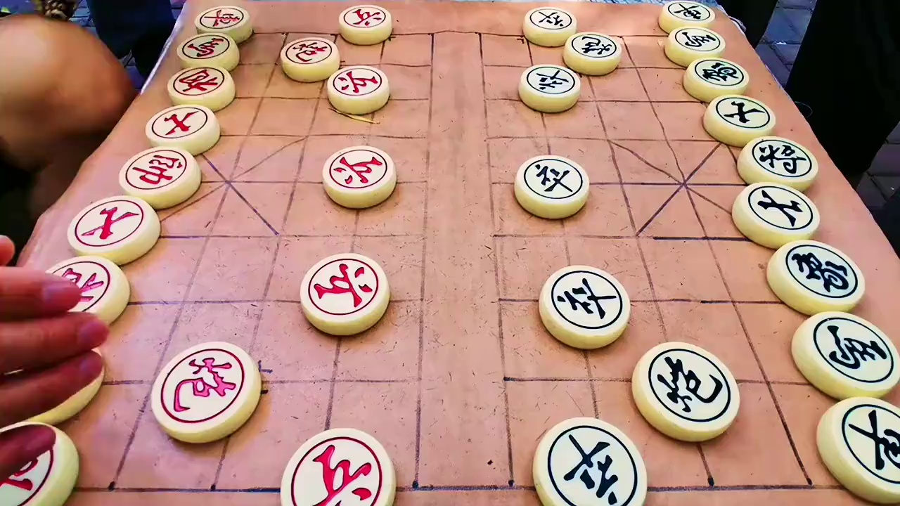
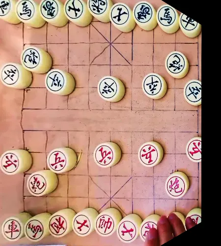

# 中国象棋识别、棋谱识别

- Chinese Chess Recognition 
- Xiangqi Recognition

# 在线 Demo

[huggingface space demo](https://huggingface.co/spaces/yolo12138/Chinese_Chess_Recognition)

> 黑子(将士相马车炮卒 对应简写`kabnrcp`) 、红子(帅将相马车炮卒 对应简写`KABNRCP`) +  其他 简写`x`  + 空位 简写`.`

## Pretrained Model

- https://huggingface.co/spaces/yolo12138/Chinese_Chess_Recognition/tree/main/onnx


# 摘要

希望开发一个更通用的中国象棋棋局识别系统，以应对复杂的真实场景下的棋局识别挑战。提出了一种基于深度学习的方法，能够直接从图像中预测棋局信息(棋盘位置，棋子位置，棋子类型)。
为此收集了一些 游戏场景、真实场景的中国象棋相关的图片、视频，涵盖多种棋局和拍摄条件。我们的模型通过创新的网络架构设计，进行高精度的棋盘检测和棋子分类识别的准确率。
由于古早时期大多都是固定的棋盘、棋子。或者是基于对棋盘、棋子特征的方案，但都存在局限性。在真实场景下，拍摄角度、棋盘、棋子都会影响识别效果。
本研究尝试使用深度学习通过分三步进行 棋盘识别、关键点检测、多区域分类检测。采用先进的 Swin Transformer2 网络架构，对棋盘进行 10x9 区域分类检测。






# 背景

象棋爱好者，希望在 AI 的帮助下，能够更快的提升棋力。
使用了多款 APP 对棋局进行拍照分析时，发现对真实场景（即非电脑画面）的棋局识别效果不佳。
特别是在某些角度，如棋盘倾斜、棋子摆放不正、棋盘背景复杂等场景下，识别效果不佳。
从效果上看上看，只针对了屏幕游戏场景进行了优化。

得益于深度学习的发展，在现在模型和方法的进步，发现在某些领域上的识别方法，与象棋也有着一定的相似性,开始尝试使用深度学习的方法进行棋谱识别问题。


# RELATED WORK

- 分步处理策略
  - 尝试方法
  - 端到端识别
  - 物体检测与关键点检测
  - 多区域分类检测

## 分步处理策略

### 尝试方法

项目开始时，尝试了多种方法，但都存在局限性。
比如：
*1.基于汉字识别*，希望借助汉字识别的模型，来识别棋子，哪怕是不准确，也可以用来帮助标注任务。但很可惜，效果并不理想，猜测是 文字识别模型，需要更多的语义上下文，对这种 单个字无意义的顺序，效果并不理想。
*2.YOLO*，尝试过，由于数据量太小，不得不放弃，也尝试自定义 header 用于处理 90 分类的棋子，但效果并不理想。因为 YOLO 的默认工作方法与实际情况不太贴合。yolo 提供的三组特征，实际也只有一个组生效，因为棋子的大小都是 差不多的。
*3.multi-head multi-task + Vision Transformer 模型*, 同时检测 90个位置的 棋子颜色，棋子文字分类(帅将、士、象相、车、马、炮、兵卒) 一起 棋局bbbox 信息。
*4.使用 LineNet 模型*，通过 棋盘的直线检测，来辅助棋子检测。
  - 
  - 但象棋的棋子是在线上的，会干扰直线的预测

除了第一个外，其他都是常用的视觉方案，但都存在局限性（超多的数据集），用于处理不同场景的识别问题。
这是人的局限性，不是模型的局限性。

### 端到端识别

这是最终的目的，最优化的模型方案，最直接的答案谁不想要呢?
但这也是最困难最复杂的方案，需要足够多的数据、足够多的标注、足够多的计算资源。
参考国际象棋领域的 [End-to-End Chess Recognition](https://arxiv.org/html/2310.04086?_immersive_translate_auto_translate=1)，
基于该文章的思路，可以实现。
但目前训练经费、计算资源 都很高、而且我没有。真实场景的标注样本也很难获取。
综上，分布标注对我来说，是更可行的方案，每一步都是相对简单，更容易验证。 


### 关键点检测

~~关键点检测，棋盘上总共 10x9 个位置。真实图片中 90 个关键点太难标注,略。~~
34 个关键点，棋盘的外圈。标注为

```
A0 A1 A2 A3 A4 A5 A6 A7 A8
B0                      B8
C0                      C8
D0                      D8
...
E-I
...
J0 J1 J2 J3 J4 J5 J6 J7 J8
```

但实际上，A1-A7 这些也可以消除，有一定的冗余性。
最终保留了 A0、A8、J0、J8 四个关键点。

参考 Figure 1


### 多区域分类检测

#### 关键点

在获取 A0、A8、J0、J8 四个关键点后，即获取棋盘的 4 个角点。
A0 与 A8, 为 黑方 的两个角点
J0 与 J8, 为 红方 的两个角点

#### 透视变化

通过 4 个角点，可以将图片透视变化成俯视图。
这不适用于国际象棋，但非常适配中国象棋。
如果因为图片拍摄角度问题，导致棋盘倾斜，这会使得预测难度提升。但透视变化后，可以减少影响。

例如：


->



#### 16 分类

16 分类包含: 黑子(将士相马车炮卒 对应简写`kabnrcp`) 、红子(帅将相马车炮卒 对应简写`KABNRCP`) +  其他 简写`x`  + 空位 简写`.`

将俯视图 通过 backbone 后，再使用 卷积 来处理特征信息，最终特征宽高为 10x9x16

最终输出特征图

```
          +----------+
         /          /|
        /         16 |
       /          /  |
      +----9-----+   |
      |          |   |
      |          |   |
      |          |   |
      |         10   +
      |          |  /
      |          | /
      |          |/
      +----------+
```

用于预测预测棋局信息

参考 Figure 2


# 研究方法

- 数据集
  - 数据采集、标注
  - 数据增强
- 识别模型
  - 网络架构与损失函数
  - 训练策略
- 评估指标

## 数据集

### 数据采集、标注

1. 目前数据集来自网络视频、以及图片，以及使用网页游戏截图。其中来自 103 个对局视频。训练图片 12000 张，测试图片 3000 张。
2. 采用 x-anything 格式存储，方便修改以及导出 yolo 格式。
3. 使用 gradio 编写 标注工具，方便处视频文件的标注，因为部分视频存在抖动无法批量标注。 
4. 预览：使用 fiftyone 预览数据集，方便查看数据集。
5. 多次迭代: 前期数量少，对错误标记进行修正.


### 数据增强

1. hsv、亮度、对比度、饱和度：这种基于颜色的变化，幅度要小，否则会改变棋子的颜色。
2. 使用随机透视变换：模拟不同拍摄角度。
3. `CChessHalfFlip`: 随机翻转复制，由于棋盘是中心对称，但棋子不是， 布局是10x9，需要特殊处理。水平复制时，调整成 4 10x4, 中线的 A4-J4 保持不动。
4. `mixup`: 由于象棋本身的棋子问题，导致棋子数量不均，需要通过其他棋子来平衡。
   - `inject pieces`: 将 棋子从图片上抠出来，然后随机粘贴到其他位置。
   - 或者将半边、1/4 边复制到 其他棋局中，并改变对应 标注信息
5. 在分类任务是，使用一些缩放、旋转、裁剪、翻转等操作，可以抵消 pose 预测的误差，增加整体鲁棒性。

## 识别模型

### 网络架构与损失函数

pose 采用了 SimCC 模型。

多区域分类检测(cchess_cls_net)，采用了 Swin Transformer2 网络架构。
使用 conv 层，来处理特征信息，最终特征宽高为 10x9x16,

loss 使用 `LabelSmoothLoss`, 如果使用 `CrossEntropyLoss` 应该也可以，但是需要进行迭代更新 gt label。

### 训练策略

使用 MMPreTrain 预训练模型,

1. 200 次 epochs, lr 0.001, 使用 AdamW 优化器。
2. 基本在 100 个 epoch 后收敛, 具体根据训练集数据大小调整。
3. 部分 embedding 使用 `freeze` 策略，在训练过程中不进行更新, 这基本不影响。
4. `weights`: 由于棋局本身限制，空位本身就很多，以及棋子数量不均，需对棋子分类权重进行调整。

```text
'point': .2,
'other': 1.,
'red_king': 2.,
'red_advisor': 1.,
'red_bishop': 1.,
'red_knight': 1.,
'red_rook': 1.,
'red_cannon': 1.,
'red_pawn': .8,
'black_king': 2.,
'black_advisor': 1.,
'black_bishop': 1.,
'black_knight': 1.,
'black_rook': 1.5,
'black_cannon': 1.,
'black_pawn': 1.,
```

### 评估指标

| 结合传统的多分类方法，使用准确率、召回率、F1 等指标。

| 指标           | 值     |
| -------------- | ------ |
| f1-score       | 0.9886 |
| f1-score_micro | 0.993  |
| mAP            | 0.995  |
| precision      | 0.988  |
| recall         | 0.992  |


| 以及对 16 分类分别作了对应的 评估

| 分类          | precision |
| ------------- | --------- |
| black_advisor | 0.996     |
| black_bishop  | 0.998     |
| black_cannon  | 0.997     |
| black_king    | 0.997     |
| ...           | ...       |
| other         | 0.951     |
| point         | 0.99      |
| ...           | ...       |


| 对90 个位置的正确率进行 评估

|     | 0    | 1    | 2    | 3    | 4    | 5    | 6    | 7    | 8    |
| --- | ---- | ---- | ---- | ---- | ---- | ---- | ---- | ---- | ---- |
| A   | 98.8 | 98.4 | 99.1 | 99.2 | 99.4 | 99.5 | 99.5 | 99.6 | 99.9 |
| ... |
| J   |


# 研究结果

- 与现有方法对比
- 消融实验


# 结论
- 主要发现
- 局限性
- 未来工作方向

# 技术框架

本项目基于以下开源框架开发：

- [MMPose](https://github.com/open-mmlab/mmpose)：用于棋盘关键点检测
- [MMPretrain](https://github.com/open-mmlab/mmpretrain)：用于棋子分类识别

感谢OpenMMLab团队提供的这些优秀工具，使本项目的开发成为可能。


# 参考文献


# 附录

- [End-to-End Chess Recognition](https://arxiv.org/html/2310.04086?_immersive_translate_auto_translate=1)
- [RTMPose]()


## 代码
- 实现细节
- 使用说明


### 安装

```bash
pip install -e .
```


## 数据集
- 数据统计
- 示例图像

